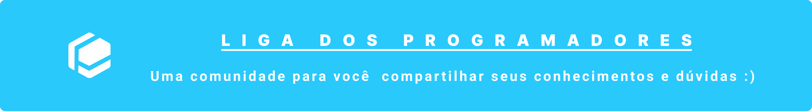

<div align="center" id="top"> 
  
&#xa0;
</div>

<p align="center">
  <a href="https://discord.gg/fmnxSYR" target="_blank">
    
  </a>
  <a href="https://github.com/Liga-dos-Programadores/Project-A/network/members" target="_blank">
    
  </a>
  <a href="https://www.gnu.org/licenses/gpl-3.0.en.html">
    
  </a>
  <a>
    
  </a>
</p>

<p align="center">
  <a href="#dart-sobre">Sobre</a> &#xa0; | &#xa0; 
  <a href="#rocket-tecnologias">Tecnologias</a> &#xa0; | &#xa0;
  <a href="#white_check_mark-requerimentos">Requerimentos</a> &#xa0; | &#xa0;
  <a href="#checkered_flag-começando">Começando</a> &#xa0; | &#xa0;
  <a href="#memo-licença">Licença</a> &#xa0;
</p>

<br>

## :dart: Sobre

Essa é página oficial da Liga dos Programadores

## :rocket: Tecnologias

As tecnologias que estão sendo usadas nesse projeto:

- [Node.js](https://nodejs.org/en/)
- [React](https://pt-br.reactjs.org/)

## :white_check_mark: Requerimentos

Antes de começar :checkered_flag:, você precisa ter [Git](https://git-scm.com) e [Node](https://nodejs.org/en/) instalado em sua máquina.

## :checkered_flag: Começando

```bash
# Clone esse projeto
$ git clone https://github.com/Liga-dos-Programadores/liga

# Acesse
$ cd liga

# Instale as dependências
$ yarn

# Rode esse projeto
$ yarn start

# O servidor irá iniciar em <http://localhost:3000>
```
## :memo: Licença

Esse projeto está sobre licença de GPL-3.0. Para mais detalhes, olhe o arquivo [LICENSE](LICENSE.md).
&#xa0;

<a href="#top">Voltar para topo</a>
